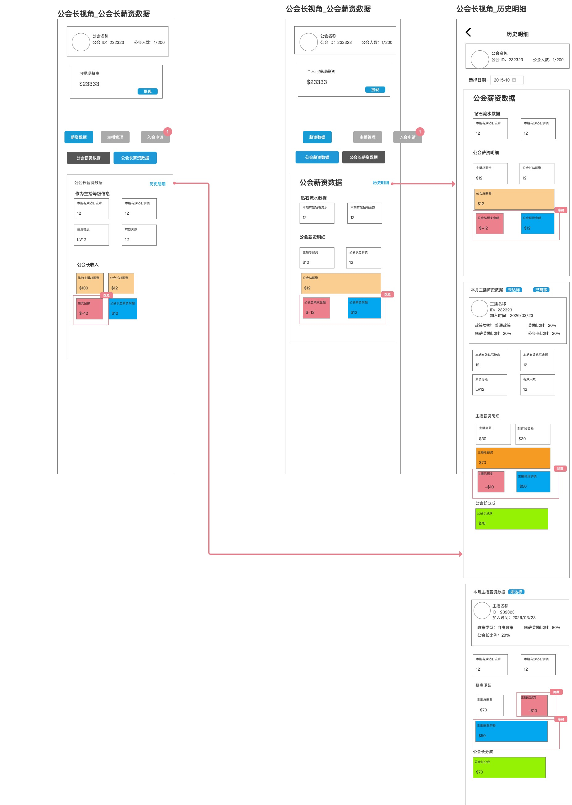
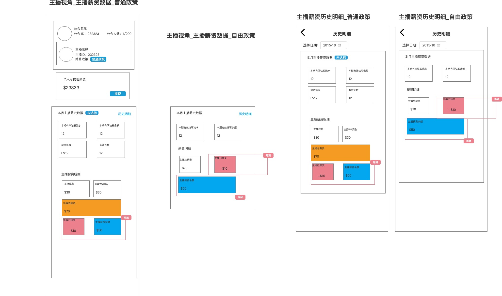
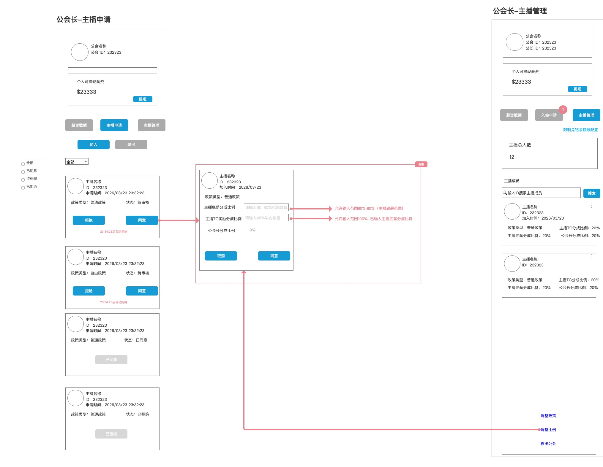
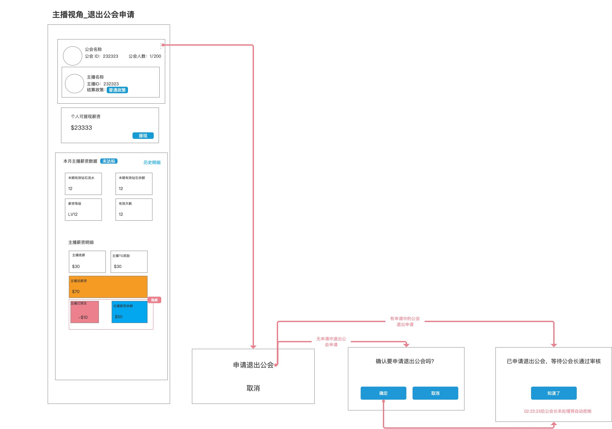
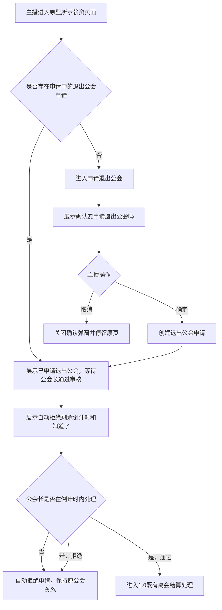
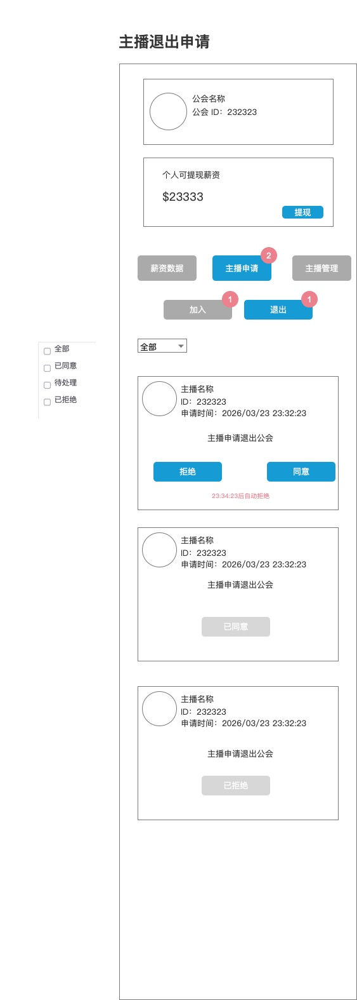
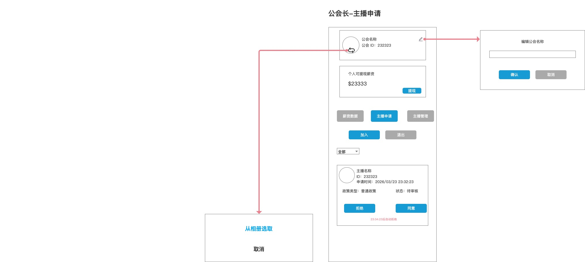
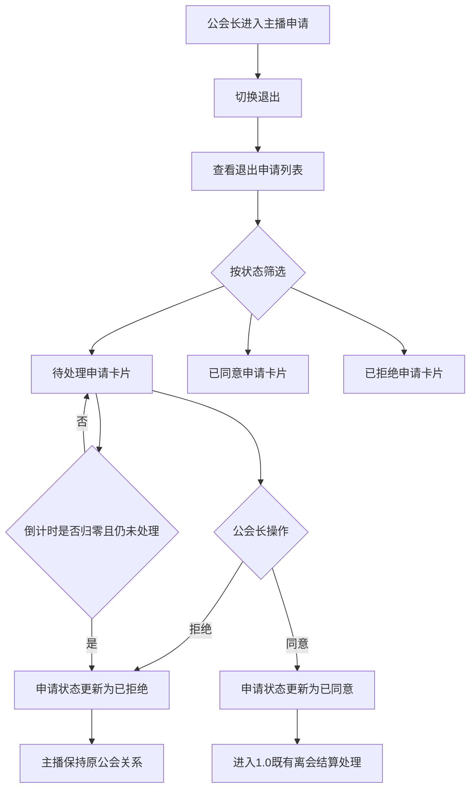
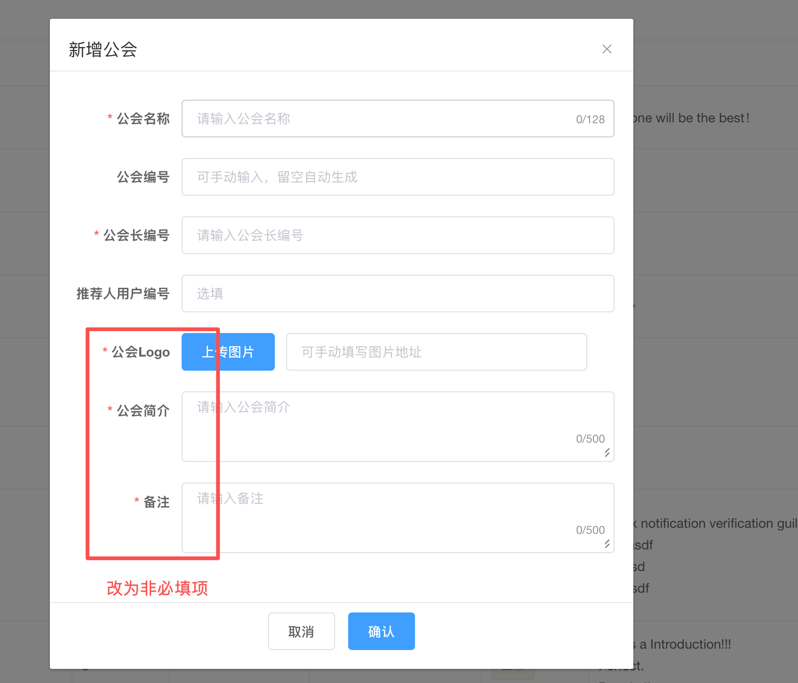

# TOPKHALIJ 公会需求 1.1：公会薪资字段隐藏、主播比例输入调整、退出公会申请管理、公会资料编辑与后台新增公会表单调整

## 一、版本目标与范围

本文仅描述 1.1 相对《TALO公会政策_客户端后台需求文档PRD》1.0 的调整：薪资展示字段隐藏、普通政策主播比例输入校验、主播退出公会申请及公会长处理申请、公会资料编辑，以及后台新增公会表单调整。未明确变更的页面、字段、交互、结算、预支、余额、提现、历史快照和离会规则均沿用 1.0。

| 项目 | 说明 |
|---|---|
| 需求版本 | 1.1 |
| 调整主题 | 隐藏薪资页面中原型圈选且标记“隐藏”的字段；调整普通政策主播比例输入逻辑；新增主播退出申请处理、公会资料编辑及后台新增公会表单调整 |
| 涉及角色 | 公会长、主播、后台运营 |
| 涉及范围 | 当前薪资数据页、历史明细页、普通政策比例设置弹窗、主播退出公会申请弹窗、公会长主播退出申请列表及其公会资料编辑入口、后台新增公会弹窗 |
| 原型依据 | 当前版本用户提供的 1.1 原型图 |
| 非本次范围 | 未圈选字段、未标记调整的页面逻辑、日期选择、提现流程及既有结算规则；不扩写原型未展示的审核确认弹窗、离会原因、撤回申请或通知规则，也不改写既有离会结算规则 |

## 二、改动总览

| 序号 | 角色/页面 | 功能/数据范围 | 核心调整 | 变更类型 |
|---:|---|---|---|---|
| 1 | 公会长薪资数据页 | 当前薪资数据 | 预支金额、公会长薪资余额 | 隐藏展示 |
| 2 | 公会薪资数据页 | 当前薪资数据 | 公会预支金额、公会薪资余额 | 隐藏展示 |
| 3 | 历史明细页 > 公会薪资数据卡片 | 所选历史月份 | 公会预支金额、公会薪资余额 | 隐藏展示 |
| 4 | 历史明细页 > 主播薪资数据卡片（普通政策） | 所选历史月份 | 主播已预支、主播薪资余额 | 隐藏展示 |
| 5 | 历史明细页 > 主播薪资数据卡片（自由政策） | 所选历史月份 | 主播已预支、主播薪资余额 | 隐藏展示 |
| 6 | 主播薪资数据页（普通政策） | 当前薪资数据 | 主播已预支、主播薪资余额 | 隐藏展示 |
| 7 | 主播薪资数据页（自由政策） | 当前薪资数据 | 主播已预支、主播薪资余额 | 隐藏展示 |
| 8 | 主播薪资历史明细页（普通政策） | 所选历史月份 | 主播已预支、主播薪资余额 | 隐藏展示 |
| 9 | 主播薪资历史明细页（自由政策） | 所选历史月份 | 主播已预支、主播薪资余额 | 隐藏展示 |
| 10 | 公会长-主播申请 > 普通政策“同意”弹窗 | 普通政策比例设置 | 主播底薪分成比例、主播TG奖励分成比例 | 调整输入校验 |
| 11 | 公会长-主播管理 > 调整比例弹窗 | 普通政策比例调整 | 主播底薪分成比例、主播TG奖励分成比例 | 调整输入校验 |
| 12 | 主播薪资数据页 > 申请退出公会 | 主播退出公会申请 | 申请确认、申请中提示、自动拒绝倒计时 | 新增申请流程 |
| 13 | 公会长 > 主播申请 > 退出 | 主播退出申请管理 | 状态筛选、申请卡片、同意/拒绝、自动拒绝倒计时 | 新增处理流程 |
| 14 | 公会长 > 主播申请 > 公会信息区 | 编辑公会名称 | 编辑入口、最多输入 64 字、确认立即生效、取消关闭 | 新增功能 |
| 15 | 公会长 > 主播申请 > 公会信息区 | 更换公会封面 | 更换入口、从相册选取、上传成功立即生效、取消关闭 | 新增功能 |
| 16 | 后台 > 公会管理 > 新增公会 | 新增公会弹窗 | 公会简介、备注改为非必填；公会 Logo 固定使用平台默认图 | 表单调整 |

## 三、公会长视角调整

### 3.1 对应原型

### 3.2 公会长薪资数据页

**调整说明：** 在“公会长收入”区域隐藏以下字段，页面不再展示字段名称、金额数值及对应展示卡片。

| 字段 | 页面位置 | 调整要求 |
|---|---|---|
| 预支金额 | 公会长收入 | 隐藏 |
| 公会长薪资余额 | 公会长收入 | 隐藏 |

### 3.3 公会薪资数据页

**调整说明：** 在“公会薪资明细”区域隐藏以下字段，页面不再展示字段名称、金额数值及对应展示卡片。

| 字段 | 页面位置 | 调整要求 |
|---|---|---|
| 公会预支金额 | 公会薪资明细 | 隐藏 |
| 公会薪资余额 | 公会薪资明细 | 隐藏 |

### 3.4 历史明细页：公会薪资数据卡片

所选历史月份的“公会薪资数据”卡片中隐藏以下字段。

| 字段 | 页面位置 | 调整要求 |
|---|---|---|
| 公会预支金额 | 公会薪资数据卡片 > 公会薪资明细 | 隐藏 |
| 公会薪资余额 | 公会薪资数据卡片 > 公会薪资明细 | 隐藏 |

### 3.5 历史明细页：主播薪资数据卡片

普通政策与自由政策均隐藏下列字段。

| 政策类型 | 字段 | 页面位置 | 调整要求 |
|---|---|---|---|
| 普通政策 | 主播已预支 | 主播薪资数据卡片 > 主播薪资明细 | 隐藏 |
| 普通政策 | 主播薪资余额 | 主播薪资数据卡片 > 主播薪资明细 | 隐藏 |
| 自由政策 | 主播已预支 | 主播薪资数据卡片 > 薪资明细 | 隐藏 |
| 自由政策 | 主播薪资余额 | 主播薪资数据卡片 > 薪资明细 | 隐藏 |

## 四、主播视角调整

### 4.1 对应原型

### 4.2 主播薪资数据页

普通政策与自由政策均隐藏下列字段。

| 政策类型 | 字段 | 页面位置 | 调整要求 |
|---|---|---|---|
| 普通政策 | 主播已预支 | 主播薪资明细 | 隐藏 |
| 普通政策 | 主播薪资余额 | 主播薪资明细 | 隐藏 |
| 自由政策 | 主播已预支 | 薪资明细 | 隐藏 |
| 自由政策 | 主播薪资余额 | 薪资明细 | 隐藏 |

### 4.3 主播薪资历史明细页

所选历史月份中，普通政策与自由政策均隐藏下列字段。

| 政策类型 | 字段 | 页面位置 | 调整要求 |
|---|---|---|---|
| 普通政策 | 主播已预支 | 主播薪资明细 | 隐藏 |
| 普通政策 | 主播薪资余额 | 主播薪资明细 | 隐藏 |
| 自由政策 | 主播已预支 | 薪资明细 | 隐藏 |
| 自由政策 | 主播薪资余额 | 薪资明细 | 隐藏 |

## 五、统一展示规则

| 规则项 | 规则 |
|---|---|
| 隐藏方式 | 对应字段的名称、金额数值及所属展示卡片均不展示。 |
| 当前与历史一致性 | 同一字段在当前薪资页和对应历史明细页同时隐藏，避免同一角色在不同页面看到不一致展示。 |
| 政策一致性 | 原型标记的主播字段，在普通政策与自由政策对应页面均同时隐藏。 |
| 空白处理 | 隐藏后不保留空白字段名、空金额、占位卡片或仅剩颜色背景的区域。 |
| 范围边界 | 本文未圈选的字段和页面功能继续沿用 1.0 文档；本次不新增页面、按钮、筛选项或计算口径。 |

## 六、影响范围说明

本次覆盖 **9 个页面/卡片状态、18 处字段展示**；仅调整上述展示项，不扩大到未圈选模块。

## 七、普通政策主播比例输入逻辑调整

### 7.1 对应原型

### 7.2 调整范围与入口

本次仅调整普通政策下的主播比例设置弹窗输入校验，两个入口共用同一套规则：

| 入口页面 | 触发动作 | 调整范围 |
|---|---|---|
| 公会长-主播申请 | 对普通政策申请点击“同意” | 弹出比例设置弹窗后，调整主播底薪分成比例、主播TG奖励分成比例的输入校验 |
| 公会长-主播管理 | 主播成员卡片更多菜单 > “调整比例” | 打开比例设置弹窗后，调整主播底薪分成比例、主播TG奖励分成比例的输入校验 |

自由政策申请沿用 1.0“无需设置比例、同意即加入”的原有逻辑；本次不调整自由政策处理方式。

### 7.3 字段输入规则

| 字段 | 当前原型输入方式 | 1.1 调整后输入逻辑 | 校验失败处理 |
|---|---|---|---|
| 主播底薪分成比例 | 手动输入百分比 | 仅允许输入 `60%` 至 `80%`（含边界）的数值。 | 输入小于 `60%`、大于 `80%`、非数值或负数时，不允许确认提交。 |
| 主播TG奖励分成比例 | 手动输入百分比 | 输入上限随已输入且校验通过的“主播底薪分成比例”动态变化：`主播TG奖励分成比例 ≤ 100% - 已输入主播底薪分成比例`。该字段仅允许输入非负数百分比。 | 未输入有效主播底薪分成比例时，不允许以该字段完成确认提交；输入值超过动态上限、为负数或非数值时，不允许确认提交。 |
| 公会长分成比例 | 原型表现为展示值 | 本次不调整该字段的既有展示/计算口径；不新增手动输入能力。 | 不适用。 |

### 7.4 联动校验规则

1. 先校验主播底薪分成比例为 `60%` 至 `80%`；通过后，主播TG奖励分成比例上限为 `100% - 已输入主播底薪分成比例`。例如底薪为 `60%` / `80%` 时，TG奖励最高为 `40%` / `20%`。
2. 底薪比例变更后立即重校验已输入的TG奖励比例；若超出新上限，保留输入供修正，但确认不可提交。
3. “主播申请 > 同意”与“主播管理 > 调整比例”的确认动作均再次校验两个字段；任一不合法均不生效。
4. 校验通过后，比例确认、参数快照和后续结算沿用 1.0；不追溯历史已生效比例。

### 7.5 边界说明

| 场景 | 处理规则 |
|---|---|
| 主播底薪分成比例为空、非数值、负数或不在 `60%` 至 `80%` | 该比例不视为有效输入；不能通过比例确认。 |
| 主播TG奖励分成比例超过动态上限 | 不能通过比例确认，需调整至 `100% - 已输入主播底薪分成比例` 以内。 |
| 主播底薪分成比例变更导致已输入TG奖励比例超限 | 保留当前输入供公会长修正，但确认动作不可提交。 |
| 同一弹窗重复点击确认 | 沿用 1.0 原有重复操作处理与参数快照规则；本次仅补充输入范围校验。 |
| 已生效的历史比例 | 不因本次输入校验调整而回算或改写；历史结算继续读取当期已生效快照。 |

## 八、主播申请退出公会流程

### 8.1 模块定位与范围

本模块仅新增主播端退出公会申请：提交后等待所属公会长处理，超时未处理自动拒绝。离会原因、撤回、违约金、结算金额展示、提现限制均不在本次范围；公会长审核见第九章，申请通过后的离会结算、预支抵扣、归属解除、余额、快照和冷却期沿用 1.0。

### 8.2 对应原型

### 8.3 状态与展示

| 状态 | 进入条件 | 主播端展示/可操作 | 状态出口 |
|---|---|---|---|
| 已加入公会且无申请中退出申请 | 主播当前存在有效公会关系，且不存在申请中的退出申请 | 可进入“申请退出公会”确认流程 | 确认提交后进入“离会申请中”；取消则停留原页 |
| 离会申请中 | 主播在确认弹窗点击“确定”且提交成功 | 展示“已申请退出公会，等待公会长通过审核”、自动拒绝剩余倒计时及“知道了”按钮 | 公会长处理申请，或倒计时归零自动拒绝 |
| 已拒绝 | 公会长拒绝，或申请倒计时归零而公会长未处理 | 退出申请结束；主播保持原公会关系 | 可按“无申请中退出申请”状态再次发起 |
| 已通过，进入既有离会处理 | 公会长通过退出申请 | 本模块不展示或定义后续结算页面，进入 1.0 离会处理链路 | 待结算保护期 → 当期结算 → 优先抵扣预支 → 离会快照 → 解除公会归属 / 冷却期 |

### 8.4 主播端交互流程

### 8.5 申请规则与边界

1. 仅当前存在有效公会关系且无申请中退出申请的主播可发起；无有效公会关系或已离会时不可发起。
2. 点击“取消”不创建申请；点击“确定”创建一条“离会申请中”记录并展示等待审核及自动拒绝倒计时。同一主播存在申请中记录时不得重复创建，再次进入仅展示当前申请。
3. 公会长拒绝或倒计时归零未处理时，申请转为已拒绝，主播保持原公会关系且不进入离会结算。
4. 公会长同意后不得直接解除公会关系：按 1.0 进入待结算保护期、当期结算、优先抵扣预支、生成离会/关系快照后解除归属。
5. 离会结算完成后清空已结算周期的钻石余额；结算后余额和可提现余额仍归主播本人，历史结果读取当期快照。公会长审核动作、审核通知及列表规则以第九章为准。

## 九、公会长处理主播退出公会申请

### 9.1 模块定位与范围

公会长通过“主播申请 > 退出”查看本公会主播退出申请，并对待处理申请执行“同意”或“拒绝”。本次仅定义原型展示的页面、字段、状态、倒计时和处理动作；不新增审核确认弹窗、审核原因、批量处理、通知、撤回或处理后编辑。

### 9.2 对应原型

### 9.3 页面入口与结构

| 区域 | 原型展示 | 处理规则 |
|---|---|---|
| 一级入口 | 薪资数据、主播申请、主播管理 | 公会长点击“主播申请”进入主播申请管理。 |
| 公会名称编辑入口 | 公会信息区右侧编辑图标 | 点击展示“编辑公会名称”弹窗。 |
| 公会封面更换入口 | 公会信息区封面更换按钮 | 点击展示更换公会封面底部弹窗。 |
| 二级切换 | 加入、退出 | 点击“退出”查看主播退出公会申请列表；加入申请逻辑不在本章改动范围。 |
| 状态筛选 | 全部、已同意、待处理、已拒绝 | 按退出申请当前状态筛选列表。 |
| 列表上方选择项 | 原型展示“全部” | 本次仅按原型保留展示和选择能力；未定义新增筛选维度、排序或分页规则。 |
| 待处理角标 | 主播申请、加入、退出入口均展示红色数字角标 | 角标统计、展示上限和处理后扣减规则见 9.3.2；不新增原型未展示的聚合入口。 |

#### 9.3.1 公会资料编辑

| 功能 | 入口 | 弹窗/操作项 | 规则 |
|---|---|---|---|
| 编辑公会名称 | 公会信息区右侧编辑图标 | “编辑公会名称”弹窗；单行输入框；确认、取消 | 输入框最多输入 64 字；点击确认后公会名称立即生效；点击取消关闭弹窗，不更改公会名称。 |
| 更换公会封面 | 公会信息区封面更换按钮 | 更换公会封面底部弹窗；从相册选取、取消 | 点击“从相册选取”拉取用户手机相册；用户选择图片并上传成功后，公会封面立即生效；点击“取消”关闭底部弹窗。 |

#### 9.3.2 待处理申请角标规则

角标仅统计**当前公会长管理公会范围内**、状态为“待处理”的加入公会申请与退出公会申请；已同意、已拒绝及系统自动处理完成的申请均不计入待处理数量。

| 角标位置 | 统计口径 | 展示规则 |
|---|---|---|
| 主播申请 | `加入申请待处理数量 + 退出申请待处理数量` | 汇总两类待处理申请数量；统计结果超过 `99` 时展示 `99+`。 |
| 加入 | `加入申请待处理数量` | 仅汇总加入公会申请的待处理数量；统计结果超过 `99` 时展示 `99+`。 |
| 退出 | `退出申请待处理数量` | 仅汇总退出公会申请的待处理数量；统计结果超过 `99` 时展示 `99+`。 |

**待处理数量变更规则：**

1. 加入/退出申请成功提交后，对应真实待处理数量加 `1`，并重算“主播申请”汇总角标。
2. 公会长同意或拒绝、或系统自动处理完成任一申请后，仅当该申请首次从“待处理”变为非待处理状态时，对应分类数量扣 `1`，并重算该分类及“主播申请”角标。
3. 处理未完成、重复处理、已处理或已被系统自动处理的申请不得再次扣减。真实数量与展示值分离：真实数量大于 `99` 显示 `99+`，等于 `99` 显示 `99`；为 `0` 时的显隐沿用既有组件规则。

### 9.4 退出申请卡片字段与状态

| 字段/控件 | 展示规则 | 数据来源 |
|---|---|---|
| 主播头像 | 展示申请主播头像 | 主播资料 |
| 主播名称 | 展示申请主播名称 | 主播资料 |
| ID | 展示申请主播 ID | 主播资料 |
| 申请时间 | 展示退出公会申请提交时间 | 退出申请记录 |
| 申请说明 | 固定展示“主播申请退出公会” | 页面文案 / 退出申请类型 |
| 自动拒绝倒计时 | 仅待处理申请展示，例如“23:34:23后自动拒绝” | 退出申请自动处理剩余时间 |
| 拒绝 / 同意 | 仅待处理申请展示可操作按钮 | 页面操作 |
| 已同意 / 已拒绝 | 已处理申请展示对应结果状态，不展示“同意/拒绝”操作按钮 | 退出申请处理结果 |

| 申请状态 | 进入条件 | 公会长端展示 | 可执行动作 | 状态出口 |
|---|---|---|---|---|
| 待处理 | 主播端成功提交退出公会申请，且尚未被处理、未超时 | 展示申请卡片、自动拒绝倒计时、“拒绝”“同意” | 拒绝、同意 | 已拒绝 / 已同意 |
| 已同意 | 公会长对待处理申请点击“同意”并处理成功 | 展示“已同意”状态 | 无 | 进入 1.0 既有离会结算处理 |
| 已拒绝 | 公会长点击“拒绝”，或待处理申请倒计时归零仍未处理 | 展示“已拒绝”状态 | 无 | 申请终止，主播保持原公会关系 |

### 9.5 公会长端处理流程

### 9.6 审核处理规则

1. 公会长仅可处理本人当前管理公会内的待处理退出申请；已同意、已拒绝或超时自动拒绝的申请不可再次处理。
2. 拒绝或超时自动拒绝后，申请为“已拒绝”，主播保持原公会关系，不进入离会结算；同意后申请为“已同意”，按 1.0 进入待结算保护期、当期结算、优先抵扣预支、生成离会快照后解除归属。
3. 处理以申请当前状态为准，仅首次成功处理生效；主播端与公会长端共用同一条退出申请记录和处理结果。

### 9.7 双端状态联动

| 触发方/事件 | 主播端状态与展示 | 公会长端状态与展示 |
|---|---|---|
| 主播确认提交退出申请 | 离会申请中；展示等待公会长审核和倒计时 | 退出申请列表新增待处理卡片，展示倒计时及“拒绝/同意” |
| 公会长同意 | 结束等待审核，进入既有离会结算处理 | 卡片展示已同意，不可再次处理 |
| 公会长拒绝 | 申请结束，保持原公会关系 | 卡片展示已拒绝，不可再次处理 |
| 倒计时归零仍未处理 | 申请自动拒绝，保持原公会关系 | 卡片展示已拒绝，不可再次处理 |

 

## 十、后台新增公会表单调整

### 10.1 模块定位与范围

后台运营在“公会管理”点击新增时展示“新增公会”弹窗。本次以当前原型为准调整表单必填项和公会 Logo 处理：公会简介、备注改为非必填；公会 Logo 统一使用平台默认图。公会长编号的既有存在性、唯一性校验，以及创建成功后的既有政策初始化处理均沿用 1.0。

### 10.2 对应原型

### 10.3 表单字段与必填项

| 字段 | 原型展示/输入 | 必填性 | 本次规则 |
|---|---|---|---|
| 公会长编号 | 单行输入框；提示“请输入公会长编号” | 必填 | 未填写时不可确认创建；存在性和唯一性校验沿用 1.0。 |
| 推荐人用户编号 | 单行输入框；提示“选填” | 非必填 | 沿用原型展示。 |
| 公会 Logo | 平台默认图 | 非必填 | 所有新增公会统一使用平台 Logo 作为默认图；仅展示平台默认图，不提供可编辑控件。 |
| 公会简介 | 多行输入框；提示“请输入公会简介”；字数显示 `0/500` | 非必填 | 原型圈选字段取消必填；填写时最多输入 `500` 字。 |
| 备注 | 多行输入框；提示“请输入备注”；字数显示 `0/500` | 非必填 | 原型圈选字段取消必填；填写时最多输入 `500` 字。 |

### 10.4 弹窗操作与创建处理

| 操作 | 处理规则 |
|---|---|
| 右上角关闭 / 取消 | 关闭“新增公会”弹窗，不创建公会。 |
| 确认 | 仅校验公会名称、公会长编号两个必填项；公会编号、推荐人用户编号、公会简介、备注留空不阻断创建。校验通过后创建公会，后续公会长编号校验和创建成功处理沿用 1.0。 |
